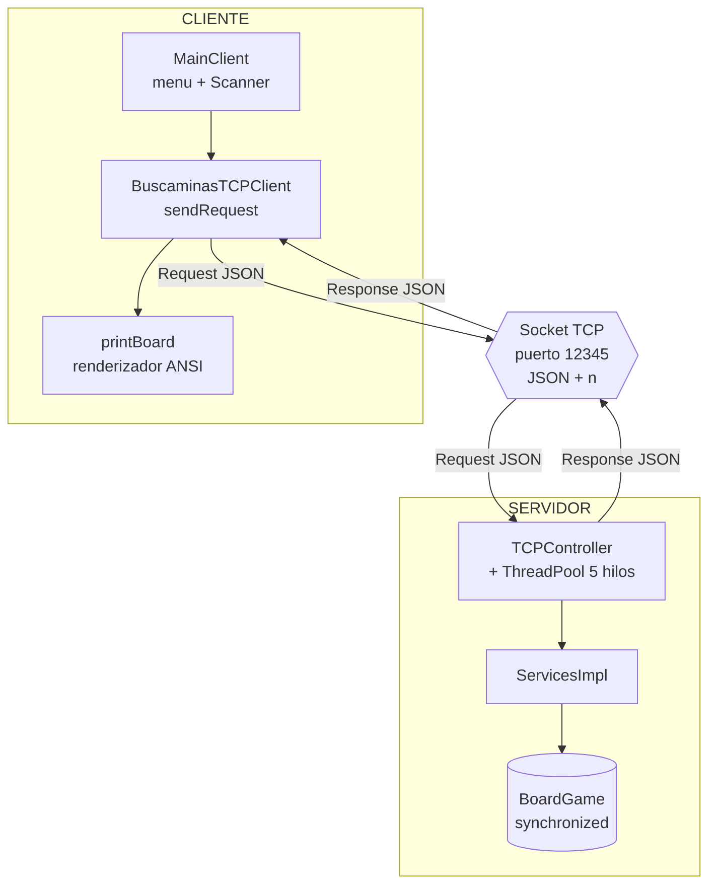

# Buscaminas Distribuido sobre TCP

Implementación cliente–servidor del clásico **Buscaminas**. La lógica del juego vive en un **servidor TCP concurrente** y uno o varios **clientes de consola** se conectan por red para jugar sobre un mismo tablero compartido.

El proyecto está organizado como un **proyecto multi-módulo de Gradle** con dos subproyectos independientes: `server/` y `client/`.

> Laboratorio de **Computación en Internet I** — Universidad Icesi.

---

## Objetivo del proyecto

Construir un juego de Buscaminas distribuido que ponga en práctica los conceptos de **comunicación por sockets TCP**, **concurrencia** y **estado compartido**:

- El **servidor** mantiene el estado del juego (una única instancia de `BoardGame`) y atiende varias conexiones en paralelo mediante un *ThreadPool*.
- El **cliente** no tiene lógica de juego: solo arma peticiones, las envía por red y dibuja el tablero que responde el servidor.
- La comunicación usa un **protocolo propio en JSON** delimitado por salto de línea (`\n`).

---

## Características

- Servidor TCP concurrente con *ThreadPool* fijo de **5 hilos**.
- **Tablero compartido**: todos los clientes juegan sobre el mismo estado del servidor.
- **Sincronización** (`synchronized`) en las operaciones que modifican el tablero, para evitar condiciones de carrera.
- Protocolo en **JSON** serializado con Gson y delimitado por `\n`.
- Cliente de consola con menú interactivo y tablero con **colores ANSI**.
- Servidor enlazado en **todas las interfaces** (`0.0.0.0`) y **puerto configurable** por línea de comandos.

---

## Requisitos previos

| Requisito | Detalle |
|---|---|
| **JDK** | Java 17 o superior instalado y en el `PATH` |
| **Gradle** | No hace falta instalarlo: el proyecto trae el *wrapper* (`gradlew`) |
| **Gson** | 2.11.0 (Gradle lo descarga solo de Maven Central) |
| **Terminal** | Windows Terminal / IntelliJ recomendado (para que se vean bien los colores ANSI) |

> Se requiere conexión a internet la primera vez, para que Gradle descargue las dependencias (Gson).

---

## Estructura del proyecto

Proyecto raíz **`buscaMinas`** con dos subproyectos declarados en `settings.gradle.kts`:

```
BuscaMinasProfeLAB/               (raíz del proyecto Gradle)
├── settings.gradle.kts           → rootProject.name = "buscaMinas"
│                                    include("server", "client")
├── gradlew / gradlew.bat         → Gradle wrapper (se ejecuta desde aquí)
├── gradle/
├── .gitignore
│
├── server/                       (SUBPROYECTO SERVIDOR)
│   ├── build.gradle.kts
│   └── src/main/java/org/galaga/
│       ├── Main.java                        → arranque del servidor (lee el puerto de args)
│       ├── Controllers/
│       │   ├── TCPController.java            → sockets, ThreadPool y switch de acciones
│       │   └── dtos/
│       │       ├── Request.java             → { action, data }
│       │       └── Response.java            → { status, data }
│       ├── model/
│       │   ├── BoardGame.java               → lógica del juego (synchronized)
│       │   └── Cell.java                    → celda del tablero
│       └── services/
│           └── ServicesImpl.java            → capa de servicios sobre BoardGame
│
└── client/                       (SUBPROYECTO CLIENTE)
    ├── build.gradle.kts
    └── src/main/java/org/buscaminasProfe/client/
        ├── MainClient.java                  → menú + renderizador del tablero
        ├── BuscaminasTCPClient.java         → envío/recepción por socket
        ├── Request.java                     → DTO (copia para el cliente)
        ├── Response.java                    → DTO (copia para el cliente)
        └── Cell.java                        → DTO (copia para el cliente)
```

### ¿Por qué se copian los DTOs?

`server` y `client` son **dos módulos Gradle independientes** que se comunican **por red**, no por dependencia de código. Por eso el cliente tiene su propia copia de `Request`, `Response` y `Cell`. Lo único que debe coincidir entre ambos lados son los **nombres de los campos** (Gson serializa/deserializa por nombre).

> El servidor usa el paquete `org.galaga` y el cliente `org.buscaminasProfe.client`. Que los paquetes difieran no es problema: al comunicarse por red, cada módulo es autónomo.

---

## Protocolo de comunicación

Cada mensaje es un objeto **JSON en una sola línea terminado en `\n`**. El cliente abre un socket, envía la petición (`Request`), lee una línea de respuesta (`Response`) y cierra la conexión (**conexión corta**: un comando = una conexión).

**Petición (`Request`)**

```json
{ "action": "SELECT_CELL", "data": { "i": "3", "j": "4" } }
```

> Los valores de `data` viajan siempre como **String** (`Map<String, String>`), porque el servidor los convierte con `Integer.parseInt(...)`.

**Acciones soportadas**

| Acción | Parámetros (`data`) | Descripción |
|---|---|---|
| `INIT_GAME` | `n`, `m`, `minas` | Crea un tablero nuevo de `n × m` con `minas` minas. |
| `SELECT_CELL` | `i`, `j` | Destapa la celda `(i, j)`. |
| `MARK_CELL` | `i`, `j` | Marca / desmarca una bandera (solo si la celda está oculta). |
| `GET_BOARD` | *(vacío)* | Devuelve el estado actual del tablero. |
| `SOW_ALL` | *(vacío)* | Revela todo el tablero (rendirse). |

**Respuesta (`Response`)**

```json
{ "status": "OK", "data": { "board": [[...]], "win": false, "gameEnd": false } }
```

---

## Arquitectura



---

## Compilación

Ubícate en la **raíz** del proyecto (donde está `gradlew`) y ejecuta:

```bash
.\gradlew build     # Windows (PowerShell)
./gradlew build     # Linux / macOS / Git Bash
```

Un solo comando compila los **dos subproyectos** (`server` y `client`). Debe terminar con `BUILD SUCCESSFUL`.

> Los comandos de Gradle **siempre** se ejecutan desde la raíz, aunque apunten a un submódulo (`:server` / `:client`).

---

## Ejecución

El servidor y el cliente se ejecutan por separado. **Primero el servidor**, luego el/los cliente(s).

**1. Servidor** (déjalo corriendo en una terminal):

```bash
.\gradlew :server:run
```

Queda escuchando en el puerto `12345`. Opcionalmente se le puede pasar otro puerto:

```bash
.\gradlew :server:run --args="9000"
```

**2. Cliente** (en otra terminal, o con el botón *Run* de IntelliJ):

```bash
.\gradlew :client:run
```

Para probar la **concurrencia**, se pueden abrir varios clientes a la vez, cada uno en su propia terminal. Todos jugarán sobre el mismo tablero del servidor.

---

## Cómo jugar

Al iniciar el cliente aparece el menú:

```
=========================================================
      BUSCAMINAS DISTRIBUIDO - CLIENTE TCP
=========================================================
[1] Iniciar nueva partida ( Filas , Columnas , Minas )
[2] Destapar celda ( Fila , Columna )
[3] Marcar / Desmarcar bandera ( Fila , Columna )
[4] Consultar estado actual del tablero
[5] Rendirse y revelar tablero completo
[6] Salir
=========================================================
```

**Símbolos del tablero:**

| Símbolo | Significado |
|---|---|
| `.` | Celda oculta (sin destapar) |
| `0`–`8` | Celda destapada: número de minas vecinas |
| `M` (amarilla) | Celda marcada con bandera |
| `*` (roja) | Mina (visible al perder o al rendirse) |

---

## Autor

**Andrés Felipe García Barrero** — Ingeniería de Sistemas, Universidad Icesi.
Curso: Computación en Internet I.
